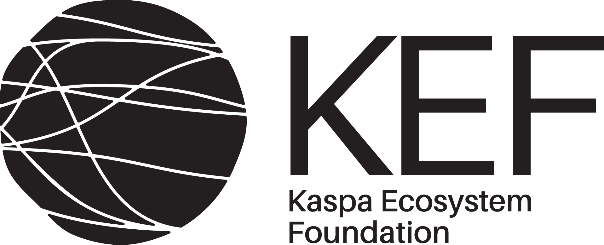

# Lattice Course

## Background

何为 Lattice？ 简单来说，它建立在多维空间中「点阵」这一精妙的数学结构之上，由此构造的密码学难题被认为具有极强的抗量子攻击能力。对于当下的 ZKP 发展而言，Lattice 的意义绝非锦上添花，而是关乎根基与未来的战略选择：

首先，这是量子安全的迫切需求。现有的主流 ZKP 方案（如基于椭圆曲线、pairing）在量子计算机面前存在理论上的脆弱性。Lattice 为构建后量子安全的零知识证明（PQ-ZKP） 提供了最具前景的数学基础。

其次，Lattice 具有构建新型 ZK 原语的潜力。当下基于格的方案已催生多项高级密码原语的构造：全同态加密（FHE）、属性基加密（ABE）、功能加密(FE)、不可区分混淆（iO）。

目前，活跃的研究前沿与标准化进程已经为 Lattice 在密码学（包括 ZKP）中的实际应用铺平了道路。NIST 的后量子密码标准化项目已遴选出多个基于 Lattice 的算法，学习 Lattice，就是参与到这场塑造未来密码格局的变革之中。

深入理解 Lattice，已不仅是密码学理论研究者的课题，更是每一位关注 ZKP 长期发展、致力于构建真正安全可信未来数字基础设施的实践者，不可或缺的知识拼图与前瞻布局。

## Intro
本次课程，我们将以 Lattice based snark 为主，从数学、pcs 及工程化三个部分展开.

### 1. 课程时间：

2025 年 6 月 16 日 - 2025 年 7 月 27 日 （6周）

### 2. 课程形式：

- 🧑‍🏫 线上直播（Zoom），每周二/四，一周两节（1-1.5h/节）

- 📢 课程通知、交流讨论（微信群）

- 💬 线上答疑：https://github.com/coset-io/zkp-academy/discussions

## Course materials

1. [Lattice Wiki](https://wiki.lacom.io/)
2. The Mathematics of Lattice-Based Cryptography, [Cryptography 101](https://cryptography101.ca/lattice-based-cryptography/)

## Class schedule

【第一周课程安排】
- 第一节课：Lattice Cryptography Overview & Why Lattice is the Future of PQ ZK Blockchain
  - 讲师：Kurt，时间：6 月 17 日晚 8 点（星期二）
  - 课程回放：[YouTube视频链接](https://youtu.be/bhOPQe9UDxk)
  - 推荐阅读：[Lattice Wiki](https://wiki.lacom.io/)
  - 课件：[Slides](https://kurtpan666.github.io/KurtPan-Slides/2506-lattice-overview/Kurt%20Pan-Lattice-Overview-2506.pdf)
- 第二节课：Lattice是什么 & average-case and worst-case hard problems
  - 讲师：Yingfei， 时间：6 月 19 日晚 8 点（星期四）
  - 课程回放：[YouTube视频链接](https://youtu.be/wvCssFhn-rc)
  - 课件：[Lattice-1](https://github.com/coset-io/zkp-academy/blob/main/lattice/slides/Lattice-1.pdf)
  - 推荐阅读：Chapter 1 & 2, [Lattice Based Cryptography for Beginners](https://eprint.iacr.org/2015/938.pdf)
- 答疑：周六晚8点 [YouTube视频](https://youtu.be/xEXm5crprbI)

【第二周课程安排】

- 第三节课：Discrete Gaussians, Rejection Sampling, Rings and Modules 
  - 讲师：Yingfei， 时间：6 月 24 日晚 8 点（星期二）
  - 课程回放：[YouTube视频链接](https://youtu.be/cMIiD4tmdVg)
  - 推荐阅读：
    - Chapter 3, [Lattice Based Cryptography for Beginners](https://eprint.iacr.org/2015/938.pdf)
    - The Mathematics of Lattice-Based Cryptography, [Cryptography 101](https://cryptography101.ca/lattice-based-cryptography/)
    - [Worst-case to average-case reductions for module lattices.](https://eprint.iacr.org/2012/090.pdf)
  - 课件：[Lattice-2](https://github.com/coset-io/zkp-academy/blob/main/lattice/slides/Lattice-2.pdf)
- 第四节课：Why NTT and how it works
  - 讲师：Bing，  时间：6 月 26 日晚 8 点（星期四）
  - 课程回放：[YouTube视频链接](https://youtu.be/94c3I3uXp6A)
  - 课件：[NTT](https://github.com/coset-io/zkp-academy/blob/main/lattice/slides/NTT.pdf)
  - 推荐阅读：
    - [Multidigit Multiplication For Mathematicians](https://cr.yp.to/papers/m3-20010811-retypeset-20220327.pdf),
    - [A Complete Beginner Guide to the Number Theoretic Transform (NTT)](https://eprint.iacr.org/2024/585.pdf)
    - [NumberTheoretic Transform and Its Applications in Lattice-based Cryptosystems: ASurvey](https://arxiv.org/pdf/2211.13546)
- 答疑：周六晚上 8 点

【第三周课程安排】

- 第五节课：Ajtai Commitment and Lyubashevsky Signature/Proofs
  - 讲师：Yingfei，  时间：7 月 1 日晚 8 点（星期二）
  - 课程回放：[Youtube视频链接](https://youtu.be/VSFvwAKYWq0)
  - 推荐阅读：Chapter 5, [Basic Lattice Cryptography](https://eprint.iacr.org/2024/1287.pdf)
  - 课件：[Lattice-3](https://github.com/coset-io/zkp-academy/blob/main/lattice/slides/Lattice-3.pdf)
- 第六节课：Building SNARKs
  - 讲师：高老师，时间：7 月 3 日晚 8 点（星期四）
  - 课程回放：
  - 课件：[Building SNARKs](https://github.com/coset-io/zkp-academy/tree/main/lattice/slides/6.Building_SNARKs.pdf)
  - 推荐阅读：[How to Make SNARKs](https://www.youtube.com/watch?v=KjkIQLJk4eQ)
- 答疑：周六晚上 8 点

【第四周课程安排】

- 第七节课：Realizing Polynomial Commitment Schemes
  - 讲师：高老师， 时间：7 月 8 日晚 8 点（星期二）
  - 课程回放：
  - 课件：[Realizing PCS](https://github.com/coset-io/zkp-academy/tree/main/lattice/slides/7.Realizing_PCS.pdf)
  - 推荐阅读：[MLE-PCS: Comparison of MLE-PCS (Final Report)](https://github.com/sec-bit/mle-pcs/blob/main/final-report.md)
- 第八节课：LaBRADOR
  - 讲师：高老师， 时间：7 月 10 日晚 8 点（星期四）
  - 课程回放：
  - 课件：[LaBRADOR](https://github.com/coset-io/zkp-academy/tree/main/lattice/slides/8.LaBRADOR.pdf)
  - 推荐阅读：[LaBRADOR: Compact Proofs for R1CS from Module-SIS](https://eprint.iacr.org/2022/1341.pdf)
- 答疑：周六晚上 8 点

【第五周课程安排】

- 第九节课：Greyhound
  - 讲师：高老师，时间：7 月 15 日晚 8 点（星期二）
  - 课程回放：
  - 课件：[Greyhound](https://github.com/coset-io/zkp-academy/tree/main/lattice/slides/9.Greyhound.pdf)
  - 推荐阅读：[Greyhound: Fast Polynomial Commitments from Lattices](https://eprint.iacr.org/2024/1293.pdf)
- 第十节课：格密碼分析初步
  - 讲师：Kurt，时间：7 月 17 日晚 8 点（星期四）
  - 参考资料：https://wiki.lacom.io/wiki/fpylll 
  - 课程回放：
  - 课件：
  - 推荐阅读：
- 答疑：周六晚上 8 点

【第六周课程安排】

- 第十一节课：Lattice ZKP Implementation : the Past, Now and the Future
  - 讲师：Kurt，时间：7 月 22 日晚 8 点（星期二）
  - 参考资料：
  - 课程回放：
  - 课件：
  - 推荐阅读：https://lattice-zk.isec.tugraz.at/

【课后作业】

## Mentors & Assistants

- **Kurt:** A Crypto-primitive-libertarian-socialist, aka a ZKPunk.
- **高尚:** 香港理工大学助理教授，近期的兴趣是研究 Lattice。
- **Yingfei:** 密码学博士，I'm interested in lattice-based zero-knowledge proofs and signatures.
- **Bing:** Independent Researcher

- **龙哥密码:** 密码学卷士生，研究过非公钥密码，对称密码，有什么不懂的随时向我请教
- **zlz:** 密码学 phd，目前研究方向是 lattice based cryptography.

## Co-learning bounty

- 为鼓励学员学习与分享，本课程继续 Co-learn notes bounty 活动，学员可以将学习中的内容整理成个人笔记提交到 github co-learn notes 目录下，收录后每篇笔记给出 200 CNY 的 bounty，并发布在 Coset 公众号上。

- 报名助教，积极回答技术问题，推动学员一起学习，不止退回押金，还可以收获 200 CNY 的 bounty。

- 值得一提的是，本次我们还鼓励大家成为 Lattice 发展的早期贡献者，为 Lattice 的未来发展添砖加瓦！对此，我们将会给予一定 bounty 的奖励，主要有以下两个方向：

「共建 Lattice Wiki」 🔗：https://wiki.lacom.io/

「Lattice 工程化实现」🔗：https://github.com/lattice-complete/Lazarus

\*笔记主题围绕 ZKP 相关技术，不局限于 Lattice。

**联系方式**：添加小助手微信 Coset2025

备注：不要吝啬给我们一个 star 哦～

## Sponsor

